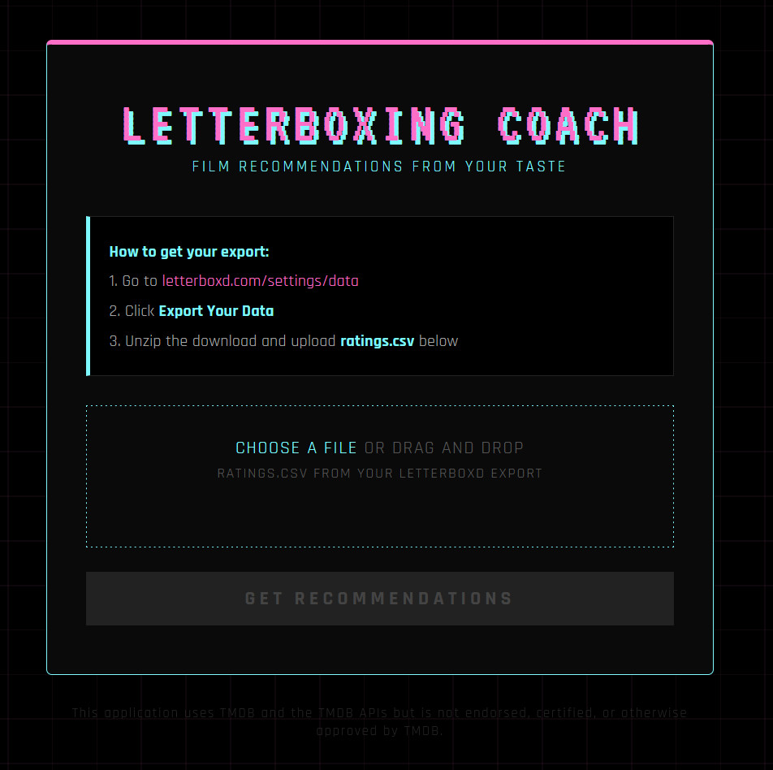

# Letterboxing Coach

A self-hosted film recommendation engine powered by your Letterboxd taste profile.

Upload your Letterboxd ratings export and get personalised recommendations using collaborative filtering against the MovieLens 25M dataset, re-ranked by TMDB metadata affinity.



---

## How it works

1. **Scrapes your taste** — parses your Letterboxd `ratings.csv` export
2. **Enriches with metadata** — resolves each film to TMDB for genres, director, cast, keywords, and runtime
3. **Finds your taste twins** — maps your ratings onto the MovieLens 25M dataset and finds your 20 nearest-neighbor users
4. **Surfaces candidates** — pulls films your taste neighbors loved that you haven't ranked in Letterboxd
5. **Re-ranks by affinity** — scores each candidate against your personal taste profile
6. **Presents results** — renders a ranked list with posters, stats, and genre tags

---

## Stack

- **Python 3.12**
- **Flask** — lightweight web server
- **pandas + scikit-learn** — data processing and KNN collaborative filtering
- **TMDB API** — film metadata and posters
- **MovieLens 25M** — collaborative filtering dataset
- **Jinja2** — HTML templating

---

## Setup

### 1. Clone the repo

```bash
git clone https://github.com/KalinJenkins/letterboxing-coach.git
cd letterboxing-coach
```

### 2. Create a virtual environment

```bash
python3 -m venv venv
source venv/bin/activate
```

### 3. Install dependencies

```bash
pip install -r requirements.txt
```

### 4. Download the MovieLens dataset

```bash
mkdir -p data
wget https://files.grouplens.org/datasets/movielens/ml-25m.zip -P data/
unzip data/ml-25m.zip -d data/
rm data/ml-25m.zip
```

### 5. Get a TMDB API key

Create a free account at [themoviedb.org](https://www.themoviedb.org/) and grab an API key from your settings.

### 6. Configure environment variables

```bash
cp .env.example .env
```

Edit `.env` and add your TMDB credentials:

```env
TMDB_API_KEY=your_key_here
TMDB_ACCESS_TOKEN=your_token_here
SECRET_KEY=your_secret_key_here
```

### 7. Run the app

```bash
python app.py
```

Visit `http://localhost:5000` in your browser.

---

## Getting your Letterboxd export

1. Go to [letterboxd.com/settings/data](https://letterboxd.com/settings/data)
2. Click **Export Your Data**
3. Unzip the download and upload **ratings.csv** via the web interface

---

## Configuration

All tuning constants live in `config.py`:

| Setting | Default | Description |
|---|---|---|
| `MIN_USER_RATINGS` | 50 | Minimum ratings for a MovieLens user to be considered |
| `N_NEIGHBORS` | 20 | Number of nearest-neighbor users to find |
| `N_CANDIDATES` | 100 | Candidate films passed to the scorer |
| `TASTE_THRESHOLD` | 3.5 | Minimum rating for a film to influence your taste profile |
| `TOP_N_RESULTS` | 25 | Number of recommendations to display |

---

## Attribution

This application uses TMDB and the TMDB APIs but is not endorsed, certified, or otherwise approved by TMDB.

---

## License

MIT
